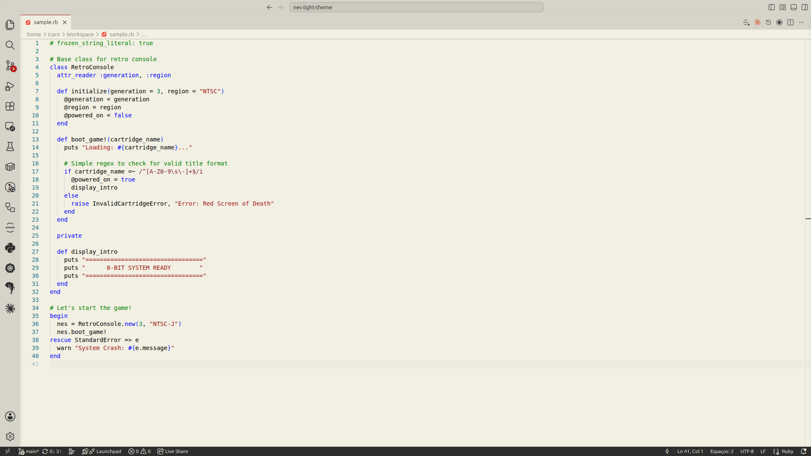

# NES Light Theme 🎮

A simple, warm, and nostatgic light theme for Visual Studio Code, heavily inspired by the iconic aesthetic of 8-bit retro consoles.

Designed to be easy on the eyes while maintaining a distinctive vintage personality, combining cozy cream backgrounds with sharp, classic action colors.

---

## 📸 Screenshots

---

## ✨ Features

- **Warm Palette:** Replaces harsh white backgrounds with a comfortable, retro cream/beige tone (`#f2f0e3`).
- **Signature Branding:** Key interface highlights and primary buttons use the classic NES dark red (`#b11e14`).
- **Clean Syntax:** Carefully tuned token coloring for HTML, CSS, JavaScript, Python, and more, keeping code highly readable without losing the retro charm.
- **Fully Customized UI:** Tailored sidebar overlays, status bars, action buttons, and drag-and-drop feedback for a cohesive experience.

---

## 🎨 The Palette

| Element | Color | Hex |
| :--- | :---: | :---: |
| Background | Cream | `#f2f0e3` |
| Primary Accent | NES Red | `#b11e14` |
| UI Elements | Dark Slate | `#2d2d2d` |
| Secondary Panels | Soft Gray | `#e4e1d7` |

---

## 🚀 Installation

1. Open **Visual Studio Code**.
2. Press `Ctrl+P` (or `Cmd+P` on Mac) to open the Quick Open dialog.
3. Type `ext install nes-light-theme` and press **Enter**.
4. Select the theme and enjoy your new retro setup!

---

**Game On! 🕹️**
